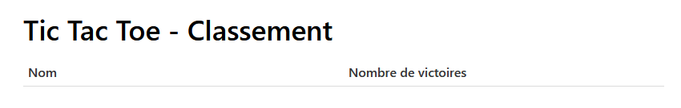
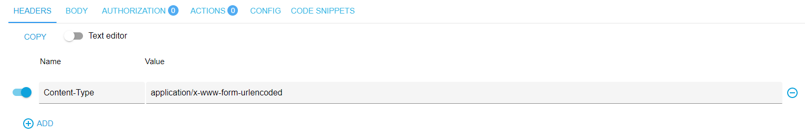
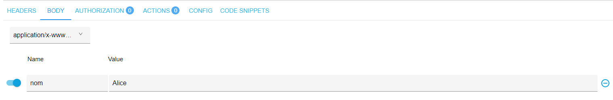
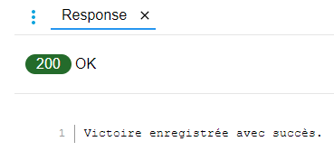

# Laboratoire 07

Dans ce laboratoire, vous aurez à modifier le code de votre laboratoire 06 pour y ajouter des requêtes HTTP
à l'API d'une application Web qui vous est fournie. Pour ce faire, vous utiliserez les fonctionnalités HTTP du module réseau de SFML. Celles-ci sont
très limitées comparativement à des bibliothèques dédiées entièrement à HTTP (telles que *libcurl*), et ne supportent
notamment pas HTTPS. Elles répondent néanmoins à notre
besoin pour ce laboratoire.

L'utilité des requêtes HTTP dans ce laboratoire est d'envoyer les victoires
du jeu de Tic Tac Toe à une application Web pour que celle-ci puisse maintenir
un classement des meilleurs joueurs. Ce classement pourra ensuite être affiché
dans le programme à l'aide d'une autre requête d'API.

## Prérequis

* Un serveur de développement incluant Apache, PHP, MySQL et phpMyAdmin (par exemple avec XAMPP)
* Le logiciel *Advanced Rest Client (ARC)* utilisé dans le laboratoire 04
* Le code du laboratoire 06 complété

## Consignes

### Étape 1 - Création de la base de données de l'application Web

Dans le dossier `web` de ce dépôt, vous trouverez des fichiers PHP
et un fichier `tictactoe.sql`.

À l'aide de phpMyAdmin, créez une base de données du nom de votre choix (ex: "tictactoe"). Sur cette base de données, exécutez le code
contenu dans `tictactoe.sql` afin de créer la table utilisée par l'API.

### Étape 2 - Mise en place de l'application Web

Dans le dossier `htdocs` de votre serveur Apache, créez un dossier
au nom de votre choix (ex: "tictactoe") pour héberger le code de l'API. Copiez-y les fichiers PHP situés dans le dossier `web` du dépôt.

Ouvrez ensuite le fichier `baseDonnees.php` à partir de l'endroit
où vous l'avez copié. Modifiez les lignes suivantes au besoin:

```php
$hoteBD = 'localhost';
$portBD = 3306;
$nomBD = 'tictactoe';
$utilisateurBD = 'root';
$motDePasseBD = null;
```

Assurez-vous particulièrement que la valeur de la variable `$portBD`
est la bonne (vous pouvez vérifier le port utilisé par MySQL dans 
le panneau de contrôle de XAMPP). Si vous avez nommé votre base de
données autrement que "tictactoe", n'oubliez pas de mettre à jour
cette valeur également.

Ensuite, à l'aide d'un navigateur Web, accédez à l'URL de 
l'application selon le dossier dans lequel vous l'avez placée
sous `htdocs` (par exemple: "http://localhost/tictactoe" —
n'oubliez pas de préciser le port du serveur Web s'il est différent de 80!). Vous
devriez voir ceci:



Assurez-vous que ça fonctionne avant de passer à l'étape suivante.

### Étape 3 - Tester l'API

Lancez l'application *Advanced REST Client (ARC)* que vous avez installée au laboratoire 04.

Vous voulez faire une requête POST à l'API de l'application Web
afin d'ajouter une victoire. Sélectionnez donc la méthode POST dans
ARC.

L'API est implémentée dans le fichier `api.php`. Vous devez donc indiquer l'URL de ce fichier. Par exemple:


L'information qu'on enverra à l'API sera au format `application/x-www-form-urlencoded`, c'est-à-dire qu'elle
sera encodée comme si les données étaient transmises
à partir d'un formulaire Web. Nous devons donc ajouter
l'en-tête HTTP `Content-Type: application/x-www-form-urlencoded`, comme ceci:



Finalement, on veut que le corps de la requête contienne
un champ "nom" dont la valeur doit être le nom de la personne
à qui on veut ajouter une victoire. Par exemple, si on veut
ajouter une victoire à Alice, on doit procéder ainsi:



On peut maintenant exécuter la requête. Si tout va bien,
on devrait obtenir la réponse suivante:



Retournez dans votre navigateur Web et actualisez la page "Tic Tac Toe - Classement". Vous devriez maintenant voir qu'Alice a 1 victoire à son actif!

Exécutez la même requête une deuxième fois, toujours avec le nom "Alice", et observez le résultat après avoir actualisé la
page à nouveau. Faites ensuite la même chose avec un nom différent.

#### Requêtes GET

L'API permet aussi d'utiliser la méthode GET pour récupérer
le classement des 10 meilleurs joueurs. Testez une requête
GET dans ARC et observez le résultat.

Puis, effectuez une requête GET à nouveau, cette fois-ci en
ajoutant `?nom=Alice` à la fin de l'URL. Observez le résultat. À quoi sert le paramètre `?nom` ?

Vous savez maintenant comment utiliser les trois fonctionnalités offertes par l'API.

### Étape 4 - Ajouter le code du laboratoire 06

Ouvrez la solution `lab07.sln` dans Visual Studio.

Regardez le contenu du fichier `main.cpp`. Vous constaterez
que le corps de la fonction `jouer` est vide. Ajoutez-y votre
code de la fonction `jouer` du laboratoire 06 (ou alternativement, celui de la solution du laboratoire 06).

Testez le programme pour vous assurer que tout fonctionne correctement.

### Étape 5 - Demander les noms des joueurs

Pour envoyer une victoire au serveur Web, il faut connaître
le nom du vainqueur. Vous devez donc commencer par modifier
votre jeu de Tic Tac Toe afin que celui-ci demande les noms
des joueurs au début de la partie.

Cela nous permettra aussi de modifier le programme
afin qu'il affiche le nom de l'autre joueur au lieu de "C'est le tour de l'autre joueur". Pour ce faire, il faudra que le serveur et le client s'échangent les noms à
l'aide de messages TCP.

**Afin de simplifier la suite du laboratoire, assumez que le nom ne contient jamais d'espace.**

Voici un aperçu de l'exécution du programme après modification:

**Serveur**

```console
TIC TAC TOE
===========
Choisir une option:
1. Créer une partie
2. Joindre une partie
Votre choix: 1

Entrez votre nom: Alice

En attente de l'autre joueur...
L'autre joueur vient de se connecter.

   1 2 3
  -------
a | | | |
  -------
b | | | |
  -------
c | | | |
  -------

C'est votre tour.
Où voulez-vous placer votre x?
ligne colonne : a 1

   1 2 3
  -------
a |x| | |
  -------
b | | | |
  -------
c | | | |
  -------

C'est le tour de Bob.
```

**Client**

```console
TIC TAC TOE
===========

Choisir une option:
1. Créer une partie
2. Joindre une partie

Votre choix: 2
Entrez l'adresse du serveur: 127.0.0.1

Entrez votre nom: Bob

   1 2 3
  -------
a | | | |
  -------
b | | | |
  -------
c | | | |
  -------

C'est le tour de Alice.

Alice a joué.

   1 2 3
  -------
a |x| | |
  -------
b | | | |
  -------
c | | | |
  -------

C'est votre tour.
Où voulez-vous placer votre x?
ligne colonne :
```

### Étape 6 - Envoyer la victoire

C'est maintenant le temps d'ajouter une première requête HTTP
à votre code!

Faites en sorte que lorsqu'une victoire est déclarée, le
**serveur** envoie le nom du vainqueur à l'API. Pour
ce faire, référez-vous au tutoriel de SFML sur l'envoi de
requêtes HTTP. Les manipulations que vous avez effectuées
à l'étape 3 vous ont montré comment utiliser l'API.

Utilisez la page Web pour valider que votre requête a fonctionné.

Par ailleurs, pour que votre programme demeure facile
à lire et à maintenir, placez le code effectuant la requête
HTTP dans une fonction à part (ex: `envoyerVictoire`).

*ℹ️ Si votre serveur Apache utilise un port autre que 80, vous devez le passer comme deuxième paramètre à la méthode `setHost` de `Http`. Voir [la documentation](https://www.sfml-dev.org/documentation/2.5.1-fr/classsf_1_1Http.php#a55121d543b61c41cf20b885a97b04e65).*

### Étape 7 - Afficher le nombre de victoires

Une fois que le **serveur** a transmis la victoire à l'API,
il doit effectuer une deuxième requête HTTP, cette fois-ci
pour récupérer le nombre total de victoires du joueur.
Encore une fois, placez ce code dans une fonction à part.

Une fois que cette information est récupérée, le serveur
doit la transmettre au client. Ensuite, **les deux** doivent afficher cette information à l'écran. Voici un exemple d'affichage:

```console
Alice a gagné!
Nombre de victoires d'Alice: 31
```

*ℹ️ Vous vous demandez peut-être pourquoi le serveur doit faire la requête HTTP et envoyer le résultat au client, alors qu'on pourrait simplement effectuer la requête HTTP des deux côtés. Si on faisait cela, on risquerait d'afficher une donnée qui n'est pas à jour sur le client, puisque celui-ci ne sait pas si le serveur a déjà envoyé la nouvelle victoire à l'API.*

### Étape 8 - Permettre de consulter le classement à même le programme

Vous devez maintenant ajouter une option `3. Afficher le classement` au menu du jeu. Celle-ci doit
récupérer le classement complet à l'aide de l'API, puis
l'afficher à l'écran. Voici un aperçu du résultat attendu:

```console
TIC TAC TOE
===========
Choisir une option:
1. Créer une partie
2. Joindre une partie
3. Afficher le classement
Votre choix: 3

Récupération du classement...

Classement:
Alice : 31 victoires
Bob : 17 victoires
Pier-Luc : 16 victoires
Rémy: 15 victoires
Geneviève: 14 victoires
Sheila: 12 victoires
Régis: 10 victoires
Simon: 8 victoires
Jacob: 6 victoires
Josianne: 4 victoires
```

### Étape 9 (facultatif) - Tester sur des ordinateurs différents

Une fois que tout est bien testé et fonctionnel, testez maintenant votre solution en plaçant l'application Web, le serveur et le client sur trois ordinateurs distincts!

## Références utiles

* [Tutoriel « Requêtes web avec HTTP » de SFML](https://www.sfml-dev.org/tutorials/2.5/network-http-fr.php)
* [Documentation de `sf::Http`](https://www.sfml-dev.org/documentation/2.5.1-fr/classsf_1_1Http.php)
